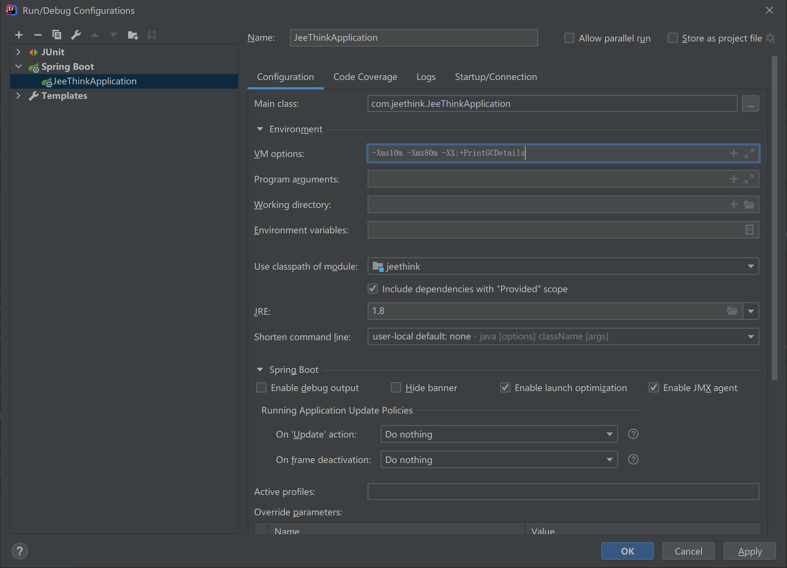
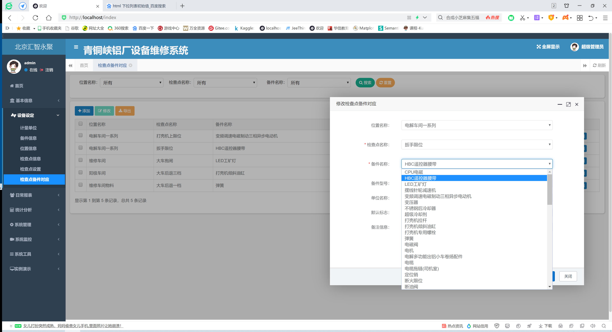

#1全局说明
##1.1 修改说明：

#####admin/admin123
##1.2 帮助文档：

###### http://www.jeethink.vip/

##运行命令：
>chcp 936
>
> java -jar manager.jar
>
***
##1.3注意：
###1.3.1 新建包平行合并解决方法：
        工程->show option menu -> flatten package / compact middle packages -> 不勾选；
###1.3.2 bootstrap 不能升级的5.0的版本；
###1.3.3 新生成的代码需要clean一下重新编译，否则界面没有生效；
###1.3.4 系统日志级别定义：resources->logback.xml文件
    	<!--系统操作日志，当前系统console输出级别定义-->
```xml
    <root level="warn">
        <appender-ref ref="file_info" />
        <appender-ref ref="file_error" />
    </root>
```
###1.3.5 编译执行错误：
现象：
    maven-resources-production:jeethink: java.lang.NegativeArraySizeException: -1944322048

解决：
    Build ——> Rebuilder Project
***
#2补充学习：
##2.1、框架学习：
###2.1.1 th:with属性允许重用变量定义在相同的属性;
```xml
    <select name="deptName" th:with="type=${@dict.getType('sys_check_type')}">
        <option value="">所有</option>
        <option th:each="dict:${type}" th:text="${dict.dictLabel}" th:value="${dict.dictValue}"></option>
    </select>
```

###2.1.2 注解@RequiresPermissions是shiro的:
shiro授权RequiresPermissions注解使用（https://blog.csdn.net/nanfang1012/article/details/81135931）
        权限控制是shiro最核心的东西,Shiro权限声明通常是使用以冒号分隔的表达式。一个权限表达式可以清晰的指定资源类型，允许的操作，可访问的数据。同时，Shiro权限表达式支持简单的通配符，可以更加灵活的进行权限设置。
        下面以实例来说明权限表达式。
        可查询用户数据
        User:view
        可查询或编辑用户数据
        User:view,edit
        可对用户数据进行所有操作
        User:* 或 user
        可编辑id为123的用户数据
        User:edit:123


```java
WorkDetailController.java:
    @RequiresPermissions("business:workdetail:view");
```

```html
workdetail.html:
    var editFlag = [[${@permission.hasPermi('business:workdetail:edit')}]];
    var removeFlag = [[${@permission.hasPermi('business:workdetail:remove')}]];
```

###2.1.3 前台参数传递：
>###(1)修改mybatis的定义：
>
>       (1)修改返回集合sql，注意type类型为String：
>```xml
>        <resultMap type="String" id="UnitNameResult">
>            <result property="unitName"    column="unit_name"    />
>        </resultMap>
>```
>        (2)编写sql；
>(2)编写domain、service、serviceImplement方法；
>
>(3)修改WorkDetailController.java指定view：
>
>>    （1）查询数据列表（ArrayList<String> deptName = deptService.selectDeptName();）
>>
>>    （2）修改函数形参（ModelMap mmap）
>>
>>    （3）将参数结果加入mmap.put("",???)（可多个）
>>
>>    （4）修改html：选择器使用select，同时加入接收参数名称（workdetail.html--> deptName=${deptNameList};
>```html
>        <select name="unitName" class="form-control m-b" th:with="BBB=${AAA}">
>            <option value="">所有</option>
>            <option th:each="BBB:${BBB}" th:text="${BBB}" th:value="${BBB}"></option>
>        </select>
>```
>**注意上面的AAA和BBB，千万不能写成AAA，这样就是传list了**

###2.1.4 页面分页显示问题：
    （1）分页设置是jt-ui.js中的pagination属性；
    （2）当前只能是bootstrapTable能够分页；bootstrapTreeTable不能实现分页；

###2.1.5多数据源：
    (1)配置yml文件中的slave的enable为true；
    (2)在service的实现类上标注数据库源（例如）：
```java
    @Service
    @DataSource(value = DataSourceType.SLAVE)
    public class testUserServiceImpl implements ItestUserService
```


###2.1.6首页的view修改：
        project/system/user/controller/indexController.java:
```java
    @GetMapping("/system/main")
    public String main(ModelMap mmap)
```


###2.1.7 查看dump文件调试技巧：
        (1)设置JVM的内存参数：-Xms10m -Xmx80m -XX:+HeapDumpOnOutOfMemoryError
        (2)执行下面的语句；
        (3)使用jprofiler查看生成的dump文件--需要安装该插件；
```java
    byte[] array = new byte[1*1024*1024];
    ArrayList<JeeThinkApplication> list = new ArrayList<>();
    int count = 0;//
            try {
                while (true) {
                    list.add(new JeeThinkApplication());
                    count = count + 1;
                }
            } catch (Error e) {
                System.out.println("count = " + count);
                e.printStackTrace();
            }
```

###2.1.8 查看代码工程设置的内存参数：
        (1)设置JVM的内存参数：-Xms10m -Xmx80m -XX:+PrintGCDetails
###
        (2)执行下列代码；
        (3)运行工程，参看输出信息;
```java
    long l = Runtime.getRuntime().maxMemory();
    long l1 = Runtime.getRuntime().totalMemory();
    System.out.println("l = " + l/1024/1024 + "   ,l1 = " + l1/1024/1024);
```
***
##2.2 修改：
###2.2.1 修改列表右侧的三个按钮不显示：jt-ui.js（bootstrap-tree-table，bootstrap-table）
    showSearch: false,
    showRefresh: false,
    showColumns: false,

###2.2.2 删除无用文件：
    index-topnav.html
    main_v1.html
    register.html

###2.2.3 配置系统全局参数，
    application.yml添加：productorNike和productorName
    jeethinkConfig.java 添加变量和get/set方法
    indexController.java /index读取参数
    index.html动态读取配置参数,方法：[[${parameter}]]

***
##2.3技巧：
###2.3.1.使用表格线：table-bordered
        slotinformation.html L54
```html
   <div class="col-sm-12 select-table table-bordered">
       <table id="bootstrap-table"></table>
   </div>
```


###2.3.2.使用格式化日期格式：
        前端使用dateFormat方法格式化日期，时间戳yyyy-MM-dd HH:mm:ss
```javascript
    {
        field: 'createTime',
        title: '创建时间',
        formatter: function(value, row, index) {
            return $.common.dateFormat(value, "yyyy-MM-dd HH-mm-ss");
        }
    },
```


###2.3.3.登录背景图
```html
    login.min.css->background:url(../img/background_1.jpg)
```


###2.3.4.列表显示方式：
        (1)列不显示：visible: false;
        (2)列内容过长处理方法，使用系统自带的方法格式化处理：
```javascript
    formatter: function(value, row, index) {
                            return $.table.tooltip(value);
                        }
```


###2.3.5.页面刷新
        (1)把如下代码加入＜head>区域中：
```html
    <!-- 其中20指每隔20秒刷新一次页面 -->
    ＜meta http-equiv="refresh" content="20">
```
        (2)页面自动刷新js版:
```javascript
    <script type="text/javascript">
        function myrefresh() {
            window.location.reload();
        }
        //指定1秒刷新一次
        setTimeout('myrefresh()', 1000);
    </script>
```

        (3)setInterval的用法：
            在指定的html页面中的script域中加入：
                setInterval($.table.refresh,1000);

###2.3.6.生成代码需要注意：
       (1)主键自增的问题：
       (2)默认值填充的问题：
       (3)下拉列表字典的问题：

###2.3.7.获取当前用户信息：
```java
    import com.jeethink.common.utils.security.ShiroUtils;
    String operName = ShiroUtils.getLoginName();
```


###2.3.8.日期控件不生效的解决方法：
        (1)mybatis的？？？Mapper文件中的日期定义，其中{params.startDate}和html中定义一致：
            参考文件：CheckItemsMapper.xml:
```xml
    <if test="params.beginStartDate != null and params.beginStartDate != ''"><!-- 开始时间检索 -->
        AND date_format(start_date,'%y%m%d') >= date_format(#{params.beginStartDate},'%y%m%d')
    </if>
    <if test="params.endStartDate != null and params.endStartDate != ''"><!-- 结束时间检索 -->
        AND date_format(end_date,'%y%m%d') <= date_format(#{params.endStartDate},'%y%m%d')
    </if>
```
        (2)Html文件中的日期定义，其中params[startDate]和mapper文件中的引用一致：
            参考文件：checkitem.html:
```html
    <li class="select-time">
        <label>日期设定：</label>
        <input type="text" class="time-input" id="startTime" placeholder="开始时间" name="params[beginStartDate]"/>
        <span>-</span>
        <input type="text" class="time-input" id="endTime" placeholder="结束时间" name="params[endStartDate]"/>
    <li>
```

        (3)思考：
            应该用${}的方式定义也应该是可以的，关键是要判断date !=''，传统模板只判断了date!=null

###2.3.9.编译执行的时候出现java.lang.OutOfMemoryError: Java heap space：
        (1)将pom文件更新后（发现springboot的版本2.17-release 和2.4.1有差异，然后“reload all maven projects。
        (2)编译执行。


###2.3.10.提示信息，@ResponseBody中使用AjaxResult：
        return AjaxResult.error("对不起，您没有权限新增任务");


###2.3.11.判断权限，根据当前用户的归属部门的级别：
```java
    /*判断权限，只有一级部门用户才能新增*/
    String loginName = ShiroUtils.getLoginName();
    Long parentId = userService.selectUserByLoginName(loginName).getDeptId();

    if (parentId == 1 && parentId != null) {
        reportDay.setCreateBy(ShiroUtils.getLoginName());
        return toAjax(reportDayService.updateReportDay(reportDay));
    }
    else {
        return AjaxResult.warn("对不起，您没有权限编辑任务");
    }
```

###2.3.12.定时任务：
        package com.jeethink.project.monitor.job.task;

###2.3.13.取下拉列表对象的值：
        (1)java代码：
```java
    Part part = new Part();
    List<Part> partList = partService.selectPartList(part);

```
        (2)html的编码：在th:text中使用object.attribute;
```html
    <select id="partName" name="partName" class="form-control m-b" th:with="partName=${partNameList}">
        <option value="">所有</option>
        <option th:each="partName:${partName}" th:text="${partName.PartName}"></option>
    </select>
```


###2.3.14.月报数据，上个月的数据查询语句：
```sql
    select  check_name, part_name, part_item, unit_name, part_count, repair_dept
    from busi_reportday
    where create_date >= (select date_sub(curdate() - day(curdate()) +1,interval 1 month))
```
###2.3.15.对于mapper中的时间区间设定的参数技巧： 
    由于 #{params.beginStartDate}中的参数是一个HashMap<String,Object> ,因此需要在设定参数的时候利用一个HashMap进行设置：

```java
    HashMap<String,Object> map = new HashMap<String, Object>();
    map.put("beginStartDate", "2021-02-01");
    map.put("endStartDate", "2021-02-01");
    reportDay.setParams(map);
    List<ReportDay> reportDays = reportDayMapper.selectReportDayList(reportDay);
```
###2.3.16.判断两个日期的间隔：
```java
    DateFormat dateFormat = new SimpleDateFormat("yyyy-MM-dd HH:mm:ss");
    Date currentDate = new Date();
    Date tempDate = new Date();
    Long maxValue = 2L;

   try {
        currentDate = dateFormat.parse(dateFormat.format(currentDate));
        tempDate = dateFormat.parse(dateFormat.format(startDate));
        dateInterval = currentDate.getTime() - tempDate.getTime();
        dateInterval = dateInterval/(1000 * 3600 * 24);
    /*整数倍判断*/
    if(dateInterval/maxValue == dateInterval * 1.0/maxValue) {

    }
    else{
    }
```

###2.3.17.取日期技巧：
        (1)当月1号日期：
            Calendar c = Calendar.getInstance();
            c.set(Calendar.DAY_OF_MONTH, 1);
        (2)上月1号日期：
            c.add(Calendar.Month,1);
        (3)当年1月1号日期：
            currentDate.get(currentDate.YEAR)+"-01-01")

###2.3.18 下拉列表默认值：
        (1)controller传出相应的列表信息；
```java
    @GetMapping("/edit/{mapId}")
    public String edit(@PathVariable("mapId") Long mapId, ModelMap mmap)
    {
        PointPartMap pointPartMap = pointPartMapService.selectPointPartMapById(mapId);
        mmap.put("pointPartMap", pointPartMap);

        /*初始化下来列表*/
        /*位置*/
        ArrayList<String> addressNameList = addressService.selectAddressNameList();

        /*检查点*/
        List<String> checkPointsList = checkPointsService.selectCheckPointsNameResult();

        /*配件列表*/
        ArrayList<String> parList = partService.selectPartNameList();

        mmap.put("addressNameList",addressNameList);
        mmap.put("checkPointsList",checkPointsList);
        mmap.put("parList",parList);
        return prefix + "/edit";
    }
```
        (2)html接收；
>原有的信息是：pointPartMap，这里包括：address、checkpoint、part的name信息
>
> 在对应的address的下拉列表中使用 th:field=*{属性名称}设置默认显示内容；
>
> 真正的下拉列表还是addressNameList的列表内容。
```html
        <form class="form-horizontal m" id="form-pointPartMap-edit" th:object="${pointPartMap}">
            <input name="mapId" th:field="*{mapId}" type="hidden">
            <div class="form-group">    
                <label class="col-sm-3 control-label">位置名称：</label>
                <div class="col-sm-8">
                    <select name="address"  class="form-control m-b" th:with="address=${addressNameList}">
                        <option th:each="address:${address}" th:text="${address}" th:value="${address}"  th:field="*{address}"></option>
                    </select>
                </div>
            </div>
```
        (3)对应的下来列表使用field属性；
         th:field="*{address}"
        (4)不影响原有的下拉列表的原有信息（列表） 
###


###2.3.19 画图说明--引用的插件有区别，千万注意：
>        (1)Echarts画图：
>        引用：<th:block th:include="include :: echarts-js" />

>        (2)sparkline
>        引用：<th:block th:include="include :: sparkline-js" />

###2.3.20 绘图（Echarts）的刷新
        根据web页面的大小，自动调整曲线图的大小
```javascript
    <!--第1步：引入js-->
    <th:block th:include="include :: echarts-js" />
    $(document).ready(function () {
        <!--第2步：echarts.init()-->
        var lineChart = echarts.init(document.getElementById("flot-dashboard-chart"));
        <!--第3步：设置option-->
        var option = {}
        <!--第4步：setOption-->        
        lineChart.setOption(option);
        <!--第5步：设置动态刷新大小-->
        $(window).resize(lineChart.resize);
    }
```